# System Flowcharts - Autonomous Pricing Engine

## 1. Complete Decision Lifecycle Flow


## 2. Agent Interaction Architecture


## 3. Guardrail Validation Flow

```mermaid
flowchart TD
    START([Pricing Decision]) --> GR1{Minimum Margin Check}
    GR1 -->|margin ≥ 25%| GR2{Maximum Discount Check}
    GR1 -->|margin < 25%| REJECT1[❌ Reject: Margin too low]
    
    GR2 -->|discount ≤ 20%| GR3{Velocity Limit Check}
    GR2 -->|discount > 20%| REJECT2[❌ Reject: Discount too high]
    
    GR3 -->|changes < 3/day| GR4{Price Change Magnitude}
    GR3 -->|changes ≥ 3/day| QUEUE[⏸️ Queue for later]
    
    GR4 -->|change < 30%| GR5{Confidence Score}
    GR4 -->|change ≥ 30%| HUMAN1[👤 Human approval required]
    
    GR5 -->|confidence ≥ 0.8| APPROVE1[✅ Approve: Execute autonomously]
    GR5 -->|0.5 ≤ confidence < 0.8| APPROVE2[✅ Approve: Execute with<br/>enhanced monitoring]
    GR5 -->|confidence < 0.5| HUMAN2[👤 Human approval required]
    
    GR5 -->|Also check| LOSS{Daily Loss Limit}
    LOSS -->|loss < ₹10,000| CONTINUE[Continue]
    LOSS -->|loss ≥ ₹10,000| PAUSE[⏸️ Pause autonomous pricing]
    
    REJECT1 --> LOG1[Log rejection reason]
    REJECT2 --> LOG1
    LOG1 --> END1([Decision Rejected])
    
    APPROVE1 --> EXEC[Execute Decision]
    APPROVE2 --> EXEC
    EXEC --> END2([Decision Executed])
    
    HUMAN1 --> END3([Awaiting Human])
    HUMAN2 --> END3
    QUEUE --> END4([Queued])
    PAUSE --> END5([System Paused])
    
    style GR1 fill:#fff9c4
    style GR2 fill:#fff9c4
    style GR3 fill:#fff9c4
    style GR4 fill:#fff9c4
    style GR5 fill:#fff9c4
    style LOSS fill:#fff9c4
    style APPROVE1 fill:#c8e6c9
    style APPROVE2 fill:#c8e6c9
    style REJECT1 fill:#ffcdd2
    style REJECT2 fill:#ffcdd2
    style HUMAN1 fill:#ffe0b2
    style HUMAN2 fill:#ffe0b2
```



## 4. Self-Correction Loop

```mermaid
flowchart TD
    START([Price Change Executed]) --> MON1[Monitor for 24 hours]
    MON1 --> MON2[Collect actual data:<br/>- Sales volume<br/>- Revenue<br/>- Margin]
    MON2 --> MON3[Compare vs predicted:<br/>- Expected: +5% revenue<br/>- Actual: -12% revenue]
    
    MON3 --> CHECK{Performance Check}
    CHECK -->|Deviation < 20%| SUCCESS([✅ Decision Successful])
    CHECK -->|Deviation ≥ 20%| ANOM[🚨 Anomaly Detected]
    
    ANOM --> CORR1[Correction Agent Activated]
    CORR1 --> CORR2[Gather evidence:<br/>- New competitor prices<br/>- Market conditions<br/>- Demand patterns]
    
    CORR2 --> CORR3[AI Root Cause Analysis]
    CORR3 --> CORR4{Classify Root Cause}
    
    CORR4 -->|Competitor Response| RC1["Competitor dropped further<br/>to ₹850 (we missed it)"]
    CORR4 -->|Demand Shift| RC2["Festival season started early<br/>Price sensitivity increased"]
    CORR4 -->|Pricing Error| RC3["Model overestimated<br/>demand elasticity"]
    CORR4 -->|External Shock| RC4["Supply chain disruption<br/>Competitor stockout"]
    
    RC1 --> CORR5[Generate corrective strategy]
    RC2 --> CORR5
    RC3 --> CORR5
    RC4 --> CORR5
    
    CORR5 --> CORR6[AI generates reasoning:<br/>"Reduce to ₹900 to match<br/>competitor and stop decline"]
    CORR6 --> CORR7[Calculate expected recovery:<br/>+15% demand vs current state]
    CORR7 --> CORR8[Assign confidence score]
    
    CORR8 --> COUNT{Correction Attempt Count}
    COUNT -->|Attempt 1 or 2| RESUBMIT[Re-submit to Supervisor]
    COUNT -->|Attempt 3| HUMAN[👤 Escalate to Human]
    
    RESUBMIT --> GUARD[Guardrail Validation]
    GUARD -->|Pass| EXEC[Execute Correction]
    GUARD -->|Fail| HUMAN
    
    EXEC --> LOG[Log correction with:<br/>- Original decision_id<br/>- Root cause<br/>- Corrective action<br/>- AI reasoning]
    LOG --> MON1
    
    HUMAN --> END1([Human Intervention])
    
    style MON1 fill:#f3e5f5
    style MON2 fill:#f3e5f5
    style MON3 fill:#f3e5f5
    style ANOM fill:#ffcdd2
    style CORR1 fill:#ffe0b2
    style CORR3 fill:#fff9c4
    style CORR5 fill:#ffe0b2
    style CORR6 fill:#fff9c4
    style SUCCESS fill:#c8e6c9
    style EXEC fill:#e8f5e9
```

## 5. AI Integration Points


## 6. Data Flow Architecture


## 7. Demo Scenario Flow

```mermaid
flowchart TD
    START([Demo Start]) --> SETUP[Setup: Product P123<br/>Current price: ₹1000<br/>Margin: 40%]
    
    SETUP --> SCENE1[🎬 Scene 1: Market Change]
    SCENE1 --> S1A[Competitor C456 drops price<br/>₹1000 → ₹900 (-10%)]
    S1A --> S1B[Market Sensing Agent detects<br/>within 15 minutes]
    S1B --> S1C[Show: CloudWatch logs<br/>Event: competitor_price_drop]
    
    S1C --> SCENE2[🎬 Scene 2: AI Decision]
    SCENE2 --> S2A[Pricing Strategy Agent analyzes]
    S2A --> S2B[Bedrock generates reasoning:<br/>'Competitor dropped 10%...<br/>Recommend ₹950 (37% margin)...<br/>Expected +5% revenue']
    S2B --> S2C[Show: Dashboard with AI reasoning<br/>Confidence: 75%]
    
    S2C --> SCENE3[🎬 Scene 3: Guardrails]
    SCENE3 --> S3A[Supervisor validates:<br/>✅ Margin 37% > 25% min<br/>✅ Discount 5% < 20% max<br/>✅ Confidence 75% > 50%]
    S3A --> S3B[Show: Guardrail checks passing]
    
    S3B --> SCENE4[🎬 Scene 4: Execution]
    SCENE4 --> S4A[Execution Agent updates:<br/>Price: ₹950 + 18% GST = ₹1121]
    S4A --> S4B[Show: DynamoDB updated<br/>Decision logged with reasoning]
    
    S4B --> SCENE5[🎬 Scene 5: Monitoring]
    SCENE5 --> S5A[Wait 24 hours simulation]
    S5A --> S5B[Actual: Sales -12%<br/>vs Predicted: +5%]
    S5B --> S5C[Show: Anomaly detected<br/>Performance alert triggered]
    
    S5C --> SCENE6[🎬 Scene 6: Self-Correction]
    SCENE6 --> S6A[Correction Agent investigates:<br/>Competitor dropped again to ₹850]
    S6A --> S6B[AI root cause analysis:<br/>'Missed second price drop...<br/>Recommend ₹900 to recover']
    S6B --> S6C[Show: Corrective decision<br/>with AI reasoning]
    S6C --> S6D[Re-execute through Supervisor]
    S6D --> S6E[Price updated to ₹900<br/>Linked to original decision]
    
    S6E --> SCENE7[🎬 Scene 7: Results]
    SCENE7 --> S7A[Show complete decision chain:<br/>Original → Underperformance → Correction]
    S7A --> S7B[Show metrics:<br/>- 85% autonomous decisions<br/>- 73% accuracy<br/>- Self-correction in 2 hours]
    
    S7B --> END([Demo Complete<br/>5 minutes total])
    
    style SCENE1 fill:#e1f5ff
    style SCENE2 fill:#fff4e1
    style SCENE3 fill:#ffcdd2
    style SCENE4 fill:#e8f5e9
    style SCENE5 fill:#f3e5f5
    style SCENE6 fill:#ffe0b2
    style SCENE7 fill:#c8e6c9
```

## How to Use These Diagrams

1. **Complete Decision Lifecycle Flow**: Use for explaining the entire system to judges
2. **Agent Interaction Architecture**: Use for technical architecture discussions
3. **Guardrail Validation Flow**: Use for explaining safety mechanisms
4. **Self-Correction Loop**: Use for demonstrating autonomous learning
5. **AI Integration Points**: Use for highlighting AI/ML components
6. **Data Flow Architecture**: Use for explaining data pipeline
7. **Demo Scenario Flow**: Use as script for live demonstration

## Rendering Instructions

These Mermaid diagrams can be rendered in:
- GitHub/GitLab markdown files (native support)
- VS Code with Mermaid extension
- Online: https://mermaid.live/
- Documentation sites (Docusaurus, MkDocs, etc.)
- Presentation tools (Marp, reveal.js)

For best results in presentations, export as SVG or PNG from mermaid.live with transparent background.
