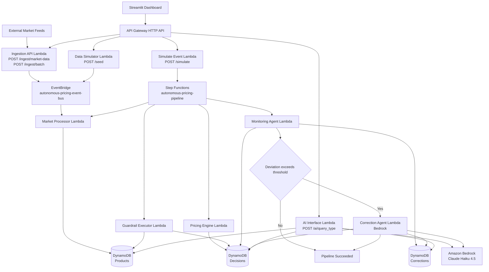

# Autonomous Pricing Engine - Updated Architecture

## Current System Architecture (Implemented)

## Pipeline Stages (Step Functions)

1. `market_processor`: writes latest competitor price and demand to `Products`.
2. `pricing_engine`: computes deterministic recommendation and stores a pending decision.
3. `guardrail_executor`: validates margin/cost/drop constraints; auto-applies approved price.
4. `monitoring_agent`: compares predicted vs actual (or simulated) outcomes.
5. `correction_agent` (conditional): runs only when deviation threshold is exceeded.

## API Surface (Current)

| Endpoint | Backing Lambda | Purpose |
|---|---|---|
| `POST /seed` | `data_simulator` | Seed demo products |
| `POST /simulate` | `simulate_event` | Generate synthetic event + start state machine |
| `POST /ingest/market-data` | `ingestion_api` | Ingest one market signal |
| `POST /ingest/batch` | `ingestion_api` | Ingest multiple market signals |
| `POST /ai/{query_type}` | `ai_interface` | Seller-facing AI manager (`query`, `daily_summary`, `onboarding`, `strategy`, `bulk_explanation`) |

## Data Model (DynamoDB)

### `autonomous-pricing-products`
- `product_id` (PK)
- Product pricing inputs and live state (`cost_price`, `current_price`, `competitor_price`, `demand_factor`, etc.)

### `autonomous-pricing-decisions`
- `decision_id` (PK)
- `product_id`, `timestamp`, input/output pricing payloads, validation/monitoring fields
- GSI: `ProductTimestampIndex` (`product_id`, `timestamp`)

### `autonomous-pricing-corrections`
- `correction_id` (PK)
- `product_id`, deviation/performance payloads, AI analysis, correction status
- GSI: `ProductIndex` (`product_id`)

## AI Usage Pattern (As Built)

- Deterministic path: `market_processor -> pricing_engine -> guardrail_executor -> monitoring_agent`
- AI path (conditional): `correction_agent` uses Bedrock only on significant deviation.
- Conversational path: `ai_interface` uses Bedrock for seller queries and summaries.

## AWS Services in Use

| Category | Service | Role in this system |
|---|---|---|
| Orchestration | AWS Step Functions | Sequential pricing workflow and branching |
| Compute | AWS Lambda | Business logic and AI-facing handlers |
| Database | Amazon DynamoDB | Products, decisions, corrections |
| API | Amazon API Gateway (HTTP API) | Public backend endpoints |
| Events | Amazon EventBridge | Ingestion-driven and async event dispatch |
| AI | Amazon Bedrock (Claude Haiku 4.5) | Correction reasoning + seller-facing explanations |
| Observability | Amazon CloudWatch + LangSmith | Logs, execution traces, prompt traces |

## Notes

- This reflects the deployed SAM stack in `lambdas/template.yaml` and `lambdas/statemachine/pricing_pipeline.asl.json`.
- The previous architecture block referenced SQS and older model labels; those are not the primary current path.
